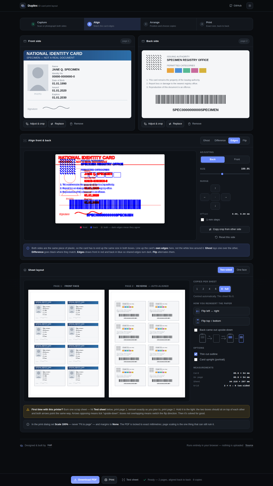
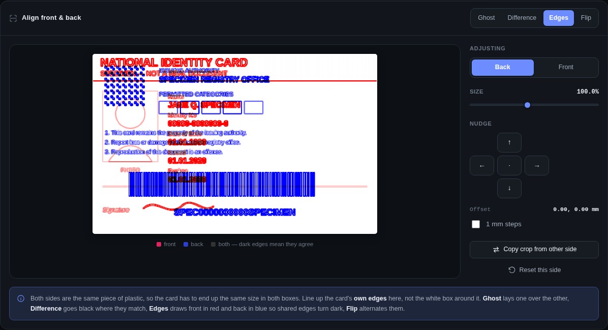
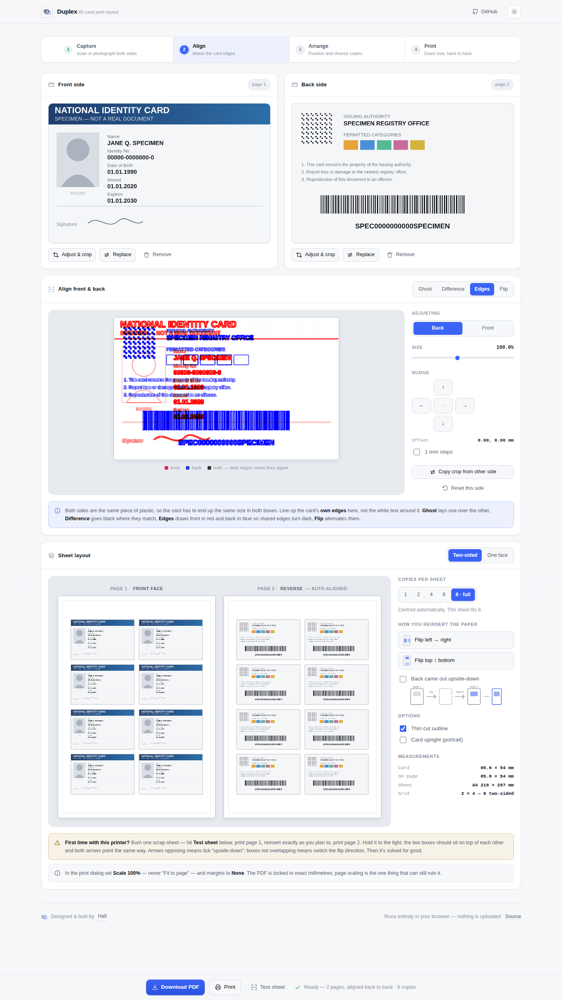

<div align="center">

# Duplex

**Both sides of an ID card on one sheet, at exact size, lined up back to back.**

A single HTML file. No build step, no dependencies, no server, no uploads.

[](#)
[](#)
[](#)
[](LICENSE)



</div>

<div align="center">
<sub>Follows your system theme, with a manual toggle. Screenshots use a fictional specimen card.</sub>
</div>

---

## The problem

Photocopying an ID card onto one sheet is a guessing game. You put the card on the glass,
print, flip the card, flip the paper, print again — and the second side lands somewhere
you didn't want, upside-down, or a different size from the first. Repeat until the paper
runs out.

Two things go wrong, and they're easy to confuse:

1. **Registration** — the back doesn't land behind the front, because you can't predict what
   your printer does with a re-fed sheet.
2. **Scale** — the two sides print at different sizes, because they were cropped differently.

Duplex fixes the first by construction and gives you the tools to see and fix the second.

## How it works

**Registration is computed, not guessed.** When you place the front at 18 mm from the left
edge, the back is automatically placed at `210 − 85.6 − 18 = 106.4 mm`. Flip the sheet and
the two cards are exactly on top of each other. The mirror is its own inverse, so you can
drag either face and the other follows.

**Scale is verifiable.** The Align panel superimposes the two sides with four overlay modes —
ghost, difference, edge-detect, and A/B flip — so a mismatch is visible before it reaches
paper. A size slider and 0.25 mm nudge fix it.



<sub>Edge-detect view: the front's outlines in red, the back's in blue. Where they coincide the
edge goes dark. A size mismatch shows up as two separated borders.</sub>

**Exact millimetres.** The PDF is written by hand, byte by byte, with the card placed via an
explicit transformation matrix. No library, no rounding through a rasteriser. Verified at
600 dpi: cards land within 0.04 mm of target.

## Features

- **Two-sided mode** — a 2-page PDF, page 2 mirrored so it registers behind page 1
- **One-face mode** — front and back on a single side, for offices that want it that way
- **Up to 8 cards per sheet** (9 in portrait), so one card doesn't waste a whole page
- **Alignment overlay** — ghost / difference / edges / flip, with per-side size and nudge
- **Printer calibration sheet** — one scrap page tells you your printer's flip behaviour, for good
- **Crop tool** locked to the real 85.6 × 54 mm ID-1 aspect, with straighten and photo clean-up
- **Scan or phone photo** — EXIF-aware, with brightness/contrast/grayscale for a clean copy
- **Follows your system theme**, with a toggle that persists — and releases back to automatic when your choice matches the OS again
- **Nothing leaves the browser** — no network calls anywhere in the source

## Use it

Open `index.html`. That's the whole installation.

```bash
git clone https://github.com/hafeee44-lab/duplex.git
cd duplex
open index.html          # or just double-click it
```

### Getting a good result

1. **Capture both sides.** A flatbed scan is best; a phone photo works if you crop carefully.
2. **Crop to the card's edge.** The box is locked to the correct aspect — put it on the card's
   actual border, not roughly around it.
3. **Check the overlay.** Switch to *Edges*. Front is red, back is blue, shared edges go dark.
   If the outlines don't sit on each other, fix it with the size slider before printing.
4. **Calibrate once.** Hit *Test sheet*, print page 1, reinsert the paper the way you intend
   to, print page 2. Hold it to the light — the boxes should overlap and both arrows point the
   same way. Arrows opposing → tick "back came out upside-down". Boxes not overlapping →
   switch the flip direction. You only ever do this once per printer.
5. **Print at 100%.** Never "Fit to page". Margins: none. This is the one remaining way to get
   the wrong size.

## Why host-based printers make this harder

Many cheap laser printers — the HP LaserJet M11xx/P11xx family among them — have no page
description language. They can't interpret PostScript or PCL; the computer must rasterise every
page and send raw bitmap data. It's why those printers often have no working driver on current
macOS, and why a USB print-server dongle can't put them on your network.

None of that affects Duplex, which produces a normal PDF. It's worth knowing if you're trying to
print from a phone to one of them — you'll need a computer with the driver in between.

## Technical notes

**The PDF writer** (`buildPdf`) emits objects and computes the cross-reference table by tracking
byte offsets as it builds. Images are embedded as JPEG XObjects with `DCTDecode` — no
re-encoding, no decompression — and shared across both pages rather than duplicated.

**Placement** (`cmFor`) returns a 6-element transformation matrix. PDF image space puts sample
(0,0) at unit-square (0,1), so the rotation matrices are written to match what the on-screen
preview shows — an easy thing to get 180° wrong, and invisible in a duplex proof because both
sides rotate together.

**The crop pipeline** draws through a canvas transform rather than a source rectangle, so the
crop window may extend past the image edge. Anything outside stays white instead of silently
distorting the card.

**N-up registration** only works if the set of occupied grid cells is symmetric about the page
centre — otherwise mirroring puts backs where no front was printed. Portrait orientation gives
3 columns, so the app only offers counts that fill whole rows.

## Screenshots

| Dark | Light |
|---|---|
|  |  |

## Testing

```bash
npm install playwright
node test/verify.js
```

50 assertions. The suite drives the real UI in headless Chromium and measures the real PDF with
`pdftoppm` (poppler-utils) plus Pillow/NumPy. It checks:

- **Registration** — un-mirroring every back position lands on a front, swept across all 20
  reachable combinations of orientation, flip direction and copy count
- **Rotation** — the PDF's placed corner matches the same corner in the on-screen preview, for
  all four orientation/flip states. This is the assertion that catches a transposed rotation
  matrix, which is otherwise invisible in a duplex proof
- **Exact size** — the card measures 85.6 × 54 mm at the requested millimetre position
- **Bounds** — no card outside the 6 mm printable margin, in any configuration
- **Alignment controls** — the size slider changes only the targeted side, reset restores
  exactly, nudge steps land on 0.25 and 1 mm
- **Theme resolution** — a fresh profile follows the OS in both directions, a manual override
  survives a reload, choosing what the OS already prefers releases the override, and everything
  still works with `localStorage` throwing
- **Robustness** — 1×1 images, non-image files, removing a side mid-edit, the flip timer
  stopping when the panel hides, rapid mode switching, no horizontal overflow at 390 px

It also regenerates the screenshots in `docs/` from a fictional specimen card.

## Browser support

Any current browser. Uses `createImageBitmap` with EXIF orientation where available and falls
back to `` decoding. Canvas, Pointer Events, and `Blob` are the only other requirements.

## License

MIT — see [LICENSE](LICENSE).

---

<div align="center">

Designed and built by **[Hafi](https://github.com/hafeee44-lab)**

</div>
